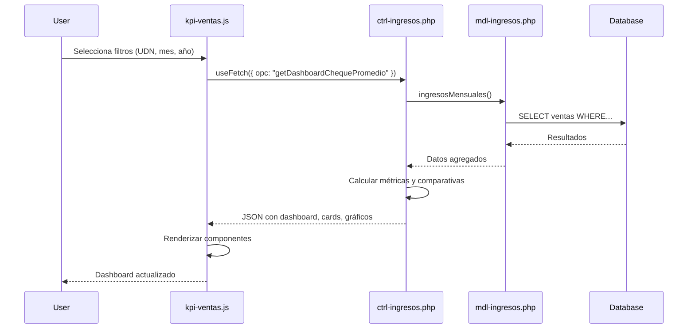

# Design Document

## Overview

El Dashboard de Cheque Promedio es un módulo analítico que se integra dentro del sistema de Ventas existente en CoffeeSoft ERP. Utiliza la arquitectura MVC establecida (Modelo-Vista-Controlador) y reutiliza componentes visuales del framework CoffeeSoft para mantener consistencia.

El dashboard se compone de:
- **4 Cards KPI** con métricas principales y comparativas
- **Gráfico de barras** para análisis por día de la semana
- **Gráfico comparativo** de cheque promedio por categoría
- **FilterBar** para selección de período y UDN

## Architecture

### Estructura de Archivos

```
kpi/marketing/ventas/
├── src/js/
│   └── kpi-ventas.js              # Frontend existente (se extiende)
├── ctrl/
│   └── ctrl-ingresos.php          # Controlador existente (se extiende)
└── mdl/
    └── mdl-ingresos.php           # Modelo existente (se extiende)
```

### Patrón de Diseño

**MVC (Model-View-Controller)**
- **Model (mdl-ingresos.php)**: Consultas a base de datos, cálculos de métricas
- **Controller (ctrl-ingresos.php)**: Lógica de negocio, formateo de respuestas
- **View (kpi-ventas.js)**: Renderizado de componentes visuales, interacción usuario

### Flujo de Datos



## Components and Interfaces

### 1. Frontend Components (kpi-ventas.js)

#### Clase: `ChequePromedioDashboard extends Templates`

**Propósito**: Gestionar la renderización del dashboard de cheque promedio

**Métodos principales**:

```javascript
class ChequePromedioDashboard extends Templates {
    constructor(link, div_modulo)
    render()                          // Inicializa layout y filtros
    layout()                          // Estructura HTML del dashboard
    filterBarDashboard()              // Crea barra de filtros
    renderDashboard()                 // Carga y muestra datos
    showCards(data)                   // Renderiza 4 cards KPI
    renderChequePorDia(data)          // Gráfico por día de semana
    renderChequeCategoria(data)       // Gráfico comparativo categorías
}
```

**Componentes CoffeeSoft utilizados**:
- `this.primaryLayout()` - Estructura base
- `this.createfilterBar()` - Barra de filtros
- `this.infoCard()` - Cards de métricas
- `this.barChart()` - Gráficos de barras
- `useFetch()` - Llamadas AJAX

### 2. Backend Controller (ctrl-ingresos.php)

#### Método: `getDashboardChequePromedio()`

**Entrada**:
```php
$_POST = [
    'opc'   => 'getDashboardChequePromedio',
    'udn'   => 1,              // ID de unidad de negocio
    'mes'   => 10,             // Mes actual
    'anio'  => 2025,           // Año actual
]
```

**Salida**:
```php
[
    'status' => 200,
    'cards' => [
        'ventaDia'       => '$12,450.00',
        'ventaMes'       => '$385,200.00',
        'clientes'       => 1250,
        'chequePromedio' => '$308.16',
        'variaciones' => [
            'ventaMes'       => '+8%',
            'clientes'       => '+5%',
            'chequePromedio' => '-2%'
        ]
    ],
    'chequePorDia' => [
        'labels' => ['Lunes', 'Martes', 'Miércoles', 'Jueves', 'Viernes', 'Sábado', 'Domingo'],
        'data'   => [320.50, 315.20, 310.80, 325.40, 340.60, 380.20, 390.50]
    ],
    'chequePorCategoria' => [
        'labels'    => ['A&B', 'Alimentos', 'Bebidas'],
        'actual'    => [673.18, 613.00, 54.60],
        'anterior'  => [640.25, 590.50, 49.75],
        'anioActual'   => 2025,
        'anioAnterior' => 2024
    ]
]
```

**Lógica**:
1. Obtener datos del mes actual y año anterior
2. Calcular métricas principales
3. Calcular variaciones porcentuales
4. Agrupar datos por día de semana
5. Calcular cheque promedio por categoría
6. Formatear respuesta JSON

### 3. Backend Model (mdl-ingresos.php)

#### Métodos a agregar/reutilizar:

```php
// Reutilizar existente
ingresosMensuales($array)           // Ya existe
getsoftVentas($array)               // Ya existe
getComparativaChequePromedio($array) // Ya existe

// Nuevos métodos
getVentasDiaAnterior($array)        // Ventas del día anterior
getChequePorDiaSemana($array)       // Promedio por día de semana
getChequeCategoriaMes($array)       // Cheque promedio por categoría
```

## Data Models

### Estructura de Datos Principal

```javascript
// Objeto de configuración del dashboard
{
    udn: 1,                    // ID unidad de negocio
    mes: 10,                   // Mes seleccionado
    anio: 2025,                // Año seleccionado
    mesAnterior: 10,           // Mismo mes año anterior
    anioAnterior: 2024         // Año anterior
}
```

### Modelo de Card KPI

```javascript
{
    id: "kpiVentaMes",
    title: "Venta del Mes",
    data: {
        value: "$385,200.00",
        description: "+8% vs año anterior",
        color: "text-green-800"
    }
}
```

### Modelo de Gráfico

```javascript
{
    labels: ['Lunes', 'Martes', ...],
    datasets: [
        {
            label: 'Cheque Promedio',
            data: [320.50, 315.20, ...],
            backgroundColor: '#103B60'
        }
    ]
}
```

## Error Handling

### Frontend

```javascript
async renderDashboard() {
    try {
        const response = await useFetch({
            url: api,
            data: { opc: "getDashboardChequePromedio", ... }
        });
        
        if (response.status === 200) {
            this.showCards(response.cards);
            this.renderChequePorDia(response.chequePorDia);
            this.renderChequeCategoria(response.chequePorCategoria);
        } else {
            alert({
                icon: "error",
                text: "Error al cargar el dashboard"
            });
        }
    } catch (error) {
        console.error("Error en renderDashboard:", error);
        alert({
            icon: "error",
            text: "Error de conexión con el servidor"
        });
    }
}
```

### Backend

```php
function getDashboardChequePromedio() {
    try {
        $udn  = isset($_POST['udn'])  ? (int)$_POST['udn']  : 1;
        $mes  = isset($_POST['mes'])  ? (int)$_POST['mes']  : date('m');
        $anio = isset($_POST['anio']) ? (int)$_POST['anio'] : date('Y');
        
        // Validaciones
        if ($mes < 1 || $mes > 12) {
            return [
                'status'  => 400,
                'message' => 'Mes inválido'
            ];
        }
        
        // Lógica de negocio...
        
        return [
            'status' => 200,
            'cards'  => $cards,
            'chequePorDia' => $chequePorDia,
            'chequePorCategoria' => $chequePorCategoria
        ];
        
    } catch (Exception $e) {
        return [
            'status'  => 500,
            'message' => 'Error interno del servidor',
            'error'   => $e->getMessage()
        ];
    }
}
```

### Manejo de Datos Vacíos

```php
// Si no hay datos para el período
if (empty($ventas)) {
    return [
        'status' => 200,
        'cards' => [
            'ventaDia'       => '$0.00',
            'ventaMes'       => '$0.00',
            'clientes'       => 0,
            'chequePromedio' => '$0.00'
        ],
        'chequePorDia' => [
            'labels' => ['Lunes', 'Martes', 'Miércoles', 'Jueves', 'Viernes', 'Sábado', 'Domingo'],
            'data'   => [0, 0, 0, 0, 0, 0, 0]
        ],
        'chequePorCategoria' => [
            'labels'  => ['A&B', 'Alimentos', 'Bebidas'],
            'actual'  => [0, 0, 0],
            'anterior' => [0, 0, 0]
        ]
    ];
}
```

## Testing Strategy

### 1. Pruebas Unitarias (Backend)

**Modelo (mdl-ingresos.php)**:
- Validar consultas SQL retornan estructura esperada
- Verificar cálculos de cheque promedio (total/clientes)
- Probar agrupación por día de semana
- Validar manejo de divisiones por cero

**Controlador (ctrl-ingresos.php)**:
- Verificar formateo de moneda con evaluar()
- Validar cálculo de variaciones porcentuales
- Probar respuesta con datos vacíos
- Verificar estructura JSON de salida

### 2. Pruebas de Integración

**Flujo completo**:
1. Seleccionar UDN, mes y año en FilterBar
2. Verificar llamada AJAX correcta
3. Validar respuesta del backend
4. Confirmar renderizado de 4 cards
5. Verificar gráficos se muestran correctamente
6. Probar cambio de filtros actualiza dashboard

### 3. Pruebas de UI

**Componentes visuales**:
- Cards muestran valores formateados correctamente
- Colores de variación (verde +, rojo -)
- Gráficos usan paleta corporativa
- Responsive en diferentes resoluciones
- Tooltips en gráficos funcionan

### 4. Casos de Prueba Específicos

| Caso | Entrada | Resultado Esperado |
|------|---------|-------------------|
| Dashboard con datos | UDN=1, mes=10, año=2025 | Muestra 4 cards con valores, 2 gráficos |
| Período sin datos | UDN=5, mes=2, año=2020 | Muestra valores en $0.00 y gráficos vacíos |
| Cambio de UDN | Cambiar de UDN 1 a 5 | Actualiza categorías (Hospedaje → Alimentos) |
| Comparativa año anterior | Año actual vs anterior | Muestra % de variación correcto |
| División por cero | Clientes = 0 | Cheque promedio = $0.00 (sin error) |

### 5. Pruebas de Rendimiento

- Dashboard debe cargar en < 2 segundos
- Consultas SQL optimizadas con índices
- Caché de datos mensuales si es posible
- Limitar consultas a período específico (no full table scan)

## Design Decisions

### 1. Reutilización vs Nueva Implementación

**Decisión**: Extender clases y métodos existentes en lugar de crear nuevos archivos

**Razón**: 
- Mantiene consistencia con arquitectura actual
- Evita duplicación de código
- Facilita mantenimiento futuro
- Aprovecha funciones ya probadas (ingresosMensuales, getsoftVentas)

### 2. Estructura de Tabs vs Dashboard Independiente

**Decisión**: Agregar como nueva pestaña en el módulo de ventas existente

**Razón**:
- Usuario ya está familiarizado con navegación por tabs
- Comparte FilterBar con otros módulos
- Mantiene contexto de análisis de ventas
- Reutiliza layout y estilos

### 3. Cálculo en Backend vs Frontend

**Decisión**: Realizar todos los cálculos en el backend (PHP)

**Razón**:
- Centraliza lógica de negocio
- Facilita testing y debugging
- Reduce carga en navegador del cliente
- Permite reutilizar cálculos en otros módulos

### 4. Formato de Fechas

**Decisión**: Usar selectores de mes/año separados en lugar de date picker

**Razón**:
- Consistente con FilterBar existente
- Análisis mensual (no diario)
- Más intuitivo para comparativas anuales
- Reutiliza componente createfilterBar()

### 5. Paleta de Colores

**Decisión**: Usar colores corporativos CoffeeSoft

**Colores**:
- Azul #103B60: Año actual, datos principales
- Verde #8CC63F: Año anterior, variaciones positivas
- Rojo: Variaciones negativas
- Gris #EAEAEA: Fondos y bordes

**Razón**:
- Mantiene identidad visual
- Usuario reconoce patrones de color
- Accesibilidad (contraste adecuado)
