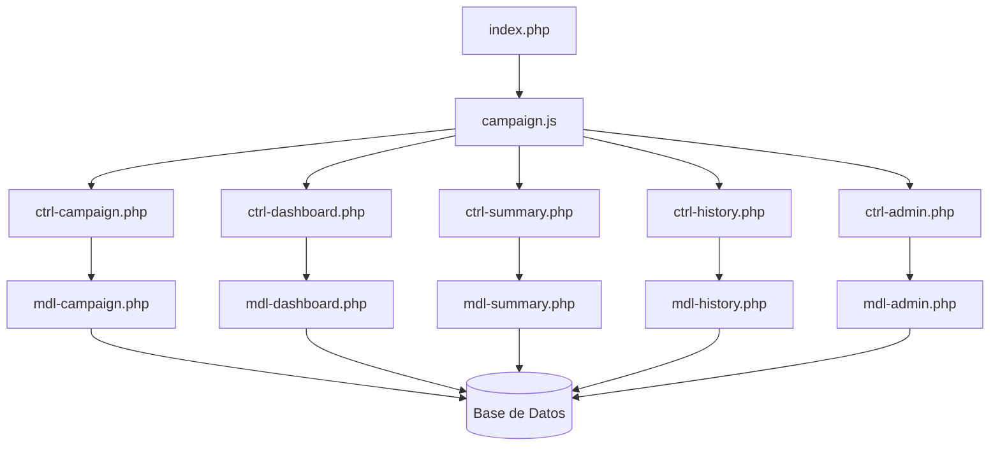
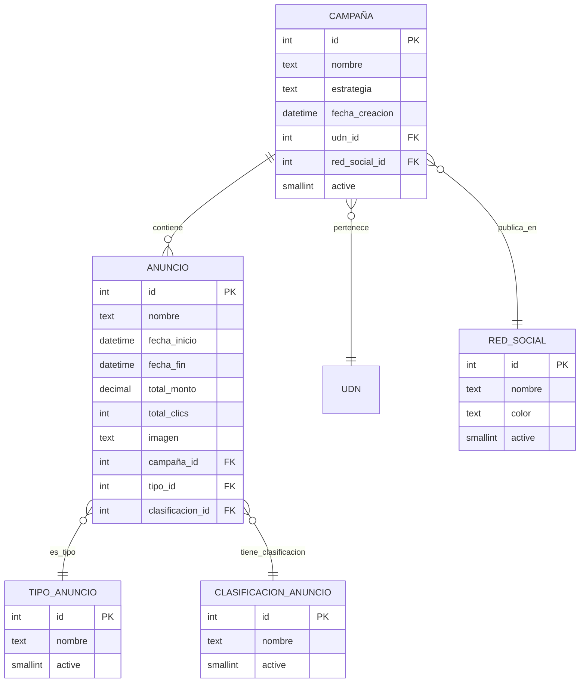

# Design Document

## Overview

El sistema de **Gestión de Campañas Publicitarias** es una aplicación web modular construida con la arquitectura MVC de CoffeeSoft. El sistema permite gestionar campañas publicitarias en redes sociales, capturar métricas de rendimiento (CPC, CAC), y visualizar reportes analíticos mediante dashboards interactivos.

**Stack Tecnológico:**
- **Frontend:** JavaScript (jQuery), TailwindCSS, Chart.js
- **Backend:** PHP 7.4+, MySQL
- **Framework:** CoffeeSoft (Templates, Components, Complements)
- **Arquitectura:** MVC (Model-View-Controller)

**Pivotes de Referencia:**
- `pivote-admin.md` - Para módulo administrador
- `pivote-analitycs-ventas.md` - Para dashboard y módulos analíticos

## Architecture

### Estructura de Directorios

```
campanas/
│
├── index.php                          # Vista principal con tabs
│
├── ctrl/                              # Controladores
│   ├── ctrl-campaign.php              # Gestión de campañas y anuncios
│   ├── ctrl-dashboard.php             # Dashboard y métricas
│   ├── ctrl-summary.php               # Resumen de campaña
│   ├── ctrl-history.php               # Historial anual (CPC/CAC)
│   └── ctrl-admin.php                 # Administrador de catálogos
│
├── mdl/                               # Modelos
│   ├── mdl-campaign.php               # Modelo de campañas y anuncios
│   ├── mdl-dashboard.php              # Modelo de dashboard
│   ├── mdl-summary.php                # Modelo de resumen
│   ├── mdl-history.php                # Modelo de historial
│   └── mdl-admin.php                  # Modelo de administrador
│
└── js/                                # Scripts JavaScript
    ├── campaign.js                    # Módulo principal
    ├── dashboard.js                   # Dashboard
    ├── summary.js                     # Resumen de campaña
    ├── history.js                     # Historial anual
    └── admin.js                       # Administrador
```

### Diagrama de Arquitectura



## Components and Interfaces

### 1. Módulo Principal (App)

**Clase:** `App extends Templates`

**Responsabilidades:**
- Inicializar el sistema y cargar datos iniciales (UDN, redes sociales, tipos, clasificaciones)
- Renderizar el layout principal con tabs
- Coordinar la navegación entre submódulos

**Métodos principales:**
```javascript
class App extends Templates {
    constructor(link, div_modulo)
    async init()                    // Carga datos iniciales
    render()                        // Renderiza layout y tabs
    layout()                        // Crea estructura con tabLayout
}
```

### 2. Dashboard de Campañas

**Clase:** `CampaignDashboard extends Templates`

**Responsabilidades:**
- Mostrar KPIs principales (inversión total, clics, CPC promedio, CAC)
- Renderizar gráficos comparativos anuales
- Filtrar por año, UDN y red social

**Componentes CoffeeSoft utilizados:**
- `dashboardComponent()` - Contenedor principal
- `infoCard()` - Tarjetas de KPIs
- `linearChart()` - Gráficos de tendencias
- `barChart()` - Comparativas mensuales
- `createfilterBar()` - Barra de filtros

**Métodos principales:**
```javascript
class CampaignDashboard extends Templates {
    render()                        // Renderiza dashboard completo
    layout()                        // Estructura del dashboard
    filterBar()                     // Filtros (año, UDN, red social)
    showCards(data)                 // KPIs visuales
    renderCharts(data)              // Gráficos de métricas
}
```

### 3. Gestión de Campañas y Anuncios

**Clase:** `Campaign extends Templates`

**Responsabilidades:**
- Crear campañas con nombre automático
- Agregar múltiples anuncios a una campaña
- Capturar resultados (clics y monto)
- Calcular CPC automáticamente

**Componentes CoffeeSoft utilizados:**
- `createTable()` - Listado de campañas/anuncios
- `createModalForm()` - Formularios de creación/edición
- `swalQuestion()` - Confirmaciones de eliminación
- `createfilterBar()` - Filtros de búsqueda

**Métodos principales:**
```javascript
class Campaign extends Templates {
    render()                        // Renderiza módulo
    layout()                        // Estructura con tabs
    filterBar()                     // Filtros
    lsCampaigns()                   // Lista campañas
    addCampaign()                   // Crear campaña
    editCampaign(id)                // Editar campaña
    addAnnouncement(campaign_id)    // Agregar anuncio
    editAnnouncement(id)            // Editar anuncio
    captureResults(id)              // Capturar clics y monto
    jsonCampaign()                  // JSON formulario campaña
    jsonAnnouncement()              // JSON formulario anuncio
}
```

### 4. Resumen de Campaña

**Clase:** `CampaignSummary extends Templates`

**Responsabilidades:**
- Mostrar resumen mensual de campañas
- Desglosar anuncios por campaña
- Calcular totales y promedios

**Componentes CoffeeSoft utilizados:**
- `createTable()` - Tabla de resumen
- `createfilterBar()` - Filtros (año, mes, UDN, red social)

**Métodos principales:**
```javascript
class CampaignSummary extends Templates {
    render()                        // Renderiza módulo
    layout()                        // Estructura
    filterBar()                     // Filtros
    lsSummary()                     // Genera resumen
}
```

### 5. Historial Anual

**Clase:** `AnnualHistory extends Templates`

**Responsabilidades:**
- Mostrar historial anual CPC
- Mostrar historial anual CAC
- Calcular métricas mensuales

**Componentes CoffeeSoft utilizados:**
- `createTable()` - Tabla de historial
- `createfilterBar()` - Filtros (año, UDN, red social, tipo reporte)
- `tabLayout()` - Tabs para CPC/CAC

**Métodos principales:**
```javascript
class AnnualHistory extends Templates {
    render()                        // Renderiza módulo
    layout()                        // Estructura con tabs
    filterBar()                     // Filtros
    lsCPC()                         // Historial CPC
    lsCAC()                         // Historial CAC
}
```

### 6. Administrador

**Clase:** `Admin extends Templates`

**Responsabilidades:**
- Gestionar tipos de anuncios
- Gestionar clasificaciones de anuncios
- CRUD completo de catálogos

**Componentes CoffeeSoft utilizados:**
- `createTable()` - Listado de registros
- `createModalForm()` - Formularios CRUD
- `swalQuestion()` - Confirmaciones
- `tabLayout()` - Tabs para tipos/clasificaciones

**Métodos principales:**
```javascript
class Admin extends Templates {
    render()                        // Renderiza módulo
    layout()                        // Estructura con tabs
    
    // Tipos de anuncios
    lsTypes()                       // Lista tipos
    addType()                       // Crear tipo
    editType(id)                    // Editar tipo
    statusType(id, active)          // Cambiar estado
    
    // Clasificaciones
    lsClassifications()             // Lista clasificaciones
    addClassification()             // Crear clasificación
    editClassification(id)          // Editar clasificación
    statusClassification(id, active) // Cambiar estado
}
```

## Data Models

### Tabla: campaña

```sql
CREATE TABLE campaña (
    id INT(11) PRIMARY KEY AUTO_INCREMENT,
    nombre TEXT,
    estrategia TEXT,
    fecha_creacion DATETIME(0),
    udn_id INT(11),
    red_social_id INT(11),
    active SMALLINT(6) DEFAULT 1,
    FOREIGN KEY (udn_id) REFERENCES udn(id),
    FOREIGN KEY (red_social_id) REFERENCES red_social(id)
);
```

**Campos:**
- `id`: Identificador único
- `nombre`: Nombre automático "Campaña {id}"
- `estrategia`: Descripción de la estrategia (alcance, mensajes, etc.)
- `fecha_creacion`: Fecha de creación de la campaña
- `udn_id`: Unidad de negocio asociada
- `red_social_id`: Red social donde se publica
- `active`: Estado (1 = activo, 0 = inactivo)

### Tabla: anuncio

```sql
CREATE TABLE anuncio (
    id INT(11) PRIMARY KEY AUTO_INCREMENT,
    nombre TEXT,
    fecha_inicio DATETIME(0),
    fecha_fin DATETIME(0),
    total_monto DECIMAL(10,0),
    total_clics INT(11),
    imagen TEXT,
    campaña_id INT(11),
    tipo_id INT(11),
    clasificacion_id INT(11),
    FOREIGN KEY (campaña_id) REFERENCES campaña(id),
    FOREIGN KEY (tipo_id) REFERENCES tipo_anuncio(id),
    FOREIGN KEY (clasificacion_id) REFERENCES clasificacion_anuncio(id)
);
```

**Campos:**
- `id`: Identificador único
- `nombre`: Nombre del anuncio
- `fecha_inicio`: Fecha de inicio de publicación
- `fecha_fin`: Fecha de fin de publicación
- `total_monto`: Inversión total en el anuncio
- `total_clics`: Total de clics obtenidos
- `imagen`: Ruta de la imagen del anuncio
- `campaña_id`: Campaña a la que pertenece
- `tipo_id`: Tipo de anuncio (video, publicación, reel)
- `clasificacion_id`: Clasificación (pauta 1, pauta 2, video A, video B)

### Tabla: tipo_anuncio

```sql
CREATE TABLE tipo_anuncio (
    id INT(11) PRIMARY KEY AUTO_INCREMENT,
    nombre TEXT,
    active SMALLINT(6) DEFAULT 1
);
```

**Campos:**
- `id`: Identificador único
- `nombre`: Nombre del tipo (video, publicación, reel, historia, etc.)
- `active`: Estado (1 = activo, 0 = inactivo)

### Tabla: clasificacion_anuncio

```sql
CREATE TABLE clasificacion_anuncio (
    id INT(11) PRIMARY KEY AUTO_INCREMENT,
    nombre TEXT,
    active SMALLINT(6) DEFAULT 1
);
```

**Campos:**
- `id`: Identificador único
- `nombre`: Nombre de la clasificación (pauta 1, pauta 2, video A, video B)
- `active`: Estado (1 = activo, 0 = inactivo)

### Tabla: red_social

```sql
CREATE TABLE red_social (
    id INT(11) PRIMARY KEY AUTO_INCREMENT,
    nombre TEXT,
    color TEXT,
    active SMALLINT(6) DEFAULT 1
);
```

**Campos:**
- `id`: Identificador único
- `nombre`: Nombre de la red social (Facebook, Instagram, TikTok, etc.)
- `color`: Color corporativo de la red social (hex)
- `active`: Estado (1 = activo, 0 = inactivo)

### Relaciones entre Tablas



## Error Handling

### Validaciones Frontend (JavaScript)

**1. Validación de Formularios:**
```javascript
// Validar campos obligatorios
if (!nombre || !fecha_inicio || !fecha_fin) {
    alert({ icon: "error", text: "Todos los campos son obligatorios" });
    return false;
}

// Validar fechas
if (new Date(fecha_fin) < new Date(fecha_inicio)) {
    alert({ icon: "error", text: "La fecha fin debe ser mayor a la fecha inicio" });
    return false;
}

// Validar montos
if (total_monto <= 0) {
    alert({ icon: "error", text: "El monto debe ser mayor a 0" });
    return false;
}
```

**2. Manejo de Respuestas AJAX:**
```javascript
success: (response) => {
    if (response.status === 200) {
        alert({ icon: "success", text: response.message });
        this.lsCampaigns();
    } else if (response.status === 409) {
        alert({ icon: "warning", text: response.message });
    } else {
        alert({ icon: "error", text: "Error al procesar la solicitud" });
    }
}
```

### Validaciones Backend (PHP)

**1. Validación de Datos:**
```php
// Validar campos obligatorios
if (empty($_POST['nombre']) || empty($_POST['fecha_inicio'])) {
    return [
        'status' => 400,
        'message' => 'Campos obligatorios faltantes'
    ];
}

// Validar fechas
if (strtotime($_POST['fecha_fin']) < strtotime($_POST['fecha_inicio'])) {
    return [
        'status' => 400,
        'message' => 'La fecha fin debe ser mayor a la fecha inicio'
    ];
}

// Validar montos
if ($_POST['total_monto'] <= 0) {
    return [
        'status' => 400,
        'message' => 'El monto debe ser mayor a 0'
    ];
}
```

**2. Manejo de Errores de Base de Datos:**
```php
try {
    $create = $this->createCampaign($this->util->sql($_POST));
    if ($create) {
        return ['status' => 200, 'message' => 'Campaña creada correctamente'];
    }
} catch (Exception $e) {
    return [
        'status' => 500,
        'message' => 'Error al crear campaña: ' . $e->getMessage()
    ];
}
```

**3. Validación de Permisos:**
```php
// Validar rol de usuario
if ($_SESSION['ROL'] !== 'Jefa de publicidad') {
    return [
        'status' => 403,
        'message' => 'No tienes permisos para realizar esta acción'
    ];
}
```

### Códigos de Estado HTTP

| Código | Significado | Uso |
|--------|-------------|-----|
| 200 | OK | Operación exitosa |
| 400 | Bad Request | Datos inválidos o faltantes |
| 403 | Forbidden | Sin permisos |
| 404 | Not Found | Registro no encontrado |
| 409 | Conflict | Registro duplicado |
| 500 | Internal Server Error | Error del servidor |

## Testing Strategy

### 1. Pruebas Unitarias (Opcional)

**Modelo (mdl):**
- Probar métodos de consulta (`listCampaigns`, `getCampaignById`)
- Probar métodos de inserción (`createCampaign`, `createAnnouncement`)
- Probar métodos de actualización (`updateCampaign`, `updateAnnouncement`)
- Probar cálculos de métricas (CPC, CAC)

**Controlador (ctrl):**
- Probar validaciones de datos
- Probar respuestas de API
- Probar manejo de errores

### 2. Pruebas de Integración

**Flujo completo de campaña:**
1. Crear campaña
2. Agregar anuncio a campaña
3. Capturar resultados
4. Verificar cálculo de CPC
5. Visualizar en dashboard

**Flujo de reportes:**
1. Filtrar por año, UDN, red social
2. Generar resumen de campaña
3. Generar historial anual CPC
4. Generar historial anual CAC
5. Verificar cálculos correctos

### 3. Pruebas de Usuario (Manual)

**Escenarios de prueba:**
- Usuario crea campaña y agrega múltiples anuncios
- Usuario captura resultados de anuncios finalizados
- Usuario visualiza dashboard con métricas actualizadas
- Usuario genera reportes mensuales y anuales
- Usuario administra catálogos (tipos, clasificaciones)
- Usuario con rol de visualización intenta editar (debe fallar)

### 4. Pruebas de Rendimiento

**Métricas a evaluar:**
- Tiempo de carga del dashboard (< 2 segundos)
- Tiempo de generación de reportes (< 3 segundos)
- Tiempo de respuesta de filtros dinámicos (< 1 segundo)
- Carga de tablas con paginación (< 2 segundos)

### 5. Pruebas de Seguridad

**Validaciones:**
- Inyección SQL (usar prepared statements)
- XSS (sanitizar inputs)
- CSRF (validar tokens de sesión)
- Control de accesos por rol
- Validación de permisos en cada operación

## Design Decisions

### 1. Uso de Pivotes como Referencia

**Decisión:** Usar `pivote-admin.md` y `pivote-analitycs-ventas.md` como base estructural.

**Razón:** 
- Garantiza consistencia con el ecosistema CoffeeSoft
- Reduce tiempo de desarrollo
- Aprovecha componentes probados y estables

### 2. Arquitectura MVC Estricta

**Decisión:** Separar completamente Modelo, Vista y Controlador.

**Razón:**
- Facilita mantenimiento y escalabilidad
- Permite trabajo en paralelo de diferentes módulos
- Mejora testabilidad del código

### 3. Cálculos Automáticos de Métricas

**Decisión:** Calcular CPC, CAC y promedios automáticamente en el backend.

**Razón:**
- Evita errores humanos
- Garantiza consistencia de datos
- Reduce carga de trabajo del usuario

### 4. Nombre Automático de Campañas

**Decisión:** Generar nombre automático "Campaña {id}" sin solicitar al usuario.

**Razón:**
- Simplifica el flujo de creación
- Evita duplicados
- Cumple con requisito específico del cliente

### 5. Uso de Chart.js para Gráficos

**Decisión:** Implementar gráficos con Chart.js en lugar de librerías más pesadas.

**Razón:**
- Ligero y rápido
- Fácil integración con jQuery
- Suficiente para las necesidades del proyecto

### 6. Filtros Dinámicos sin Recarga

**Decisión:** Actualizar datos mediante AJAX sin recargar la página.

**Razón:**
- Mejora experiencia de usuario
- Reduce tiempos de espera
- Interfaz más fluida y moderna

### 7. Control de Accesos por Sesión PHP

**Decisión:** Validar permisos usando `$_SESSION['ROL']` en backend.

**Razón:**
- Seguridad centralizada
- Fácil de mantener
- Compatible con sistema de autenticación existente

### 8. Tema Corporativo CoffeeSoft

**Decisión:** Usar colores corporativos (#103B60, #8CC63F) y tema dark/light.

**Razón:**
- Consistencia visual con otros módulos
- Identidad de marca
- Experiencia de usuario unificada
