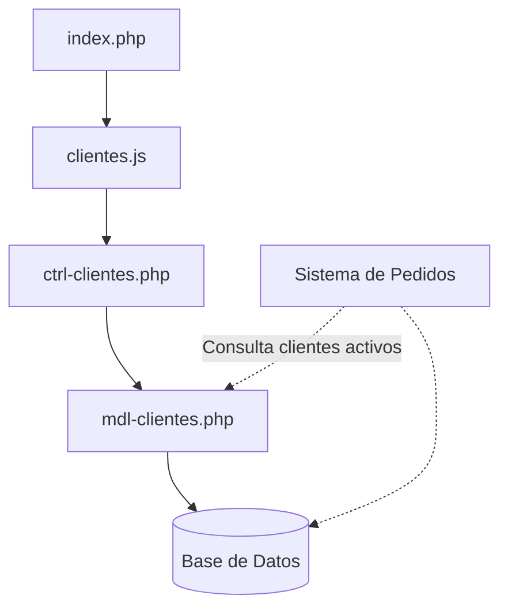
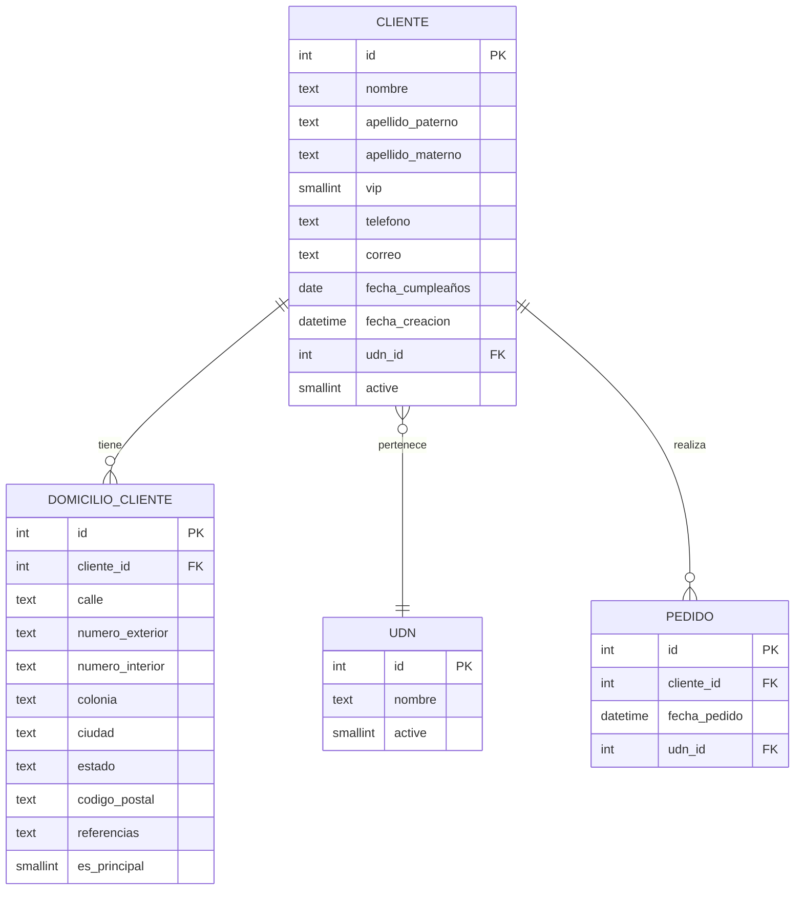

# Design Document - Gestión de Clientes

## Overview

El sistema de **Gestión de Clientes** es un módulo del sistema KPI/Marketing construido con la arquitectura MVC de CoffeeSoft. El sistema permite administrar integralmente los clientes de las unidades de negocio que realizan pedidos a domicilio, proporcionando control sobre información personal, procedencia, comportamiento y clasificación (activo, inactivo, VIP).

**Stack Tecnológico:**
- **Frontend:** JavaScript (jQuery), TailwindCSS
- **Backend:** PHP 7.4+, MySQL
- **Framework:** CoffeeSoft (Templates, Components, Complements)
- **Arquitectura:** MVC (Model-View-Controller)

**Pivote de Referencia:**
- `pivote-admin.md` - Para estructura de módulo administrador con tabs

## Architecture

### Estructura de Directorios

```
kpi/marketing/clientes/
│
├── index.php                          # Vista principal del módulo
│
├── ctrl/                              # Controladores
│   └── ctrl-clientes.php              # Gestión de clientes
│
├── mdl/                               # Modelos
│   └── mdl-clientes.php               # Modelo de clientes
│
└── js/                                # Scripts JavaScript
    └── clientes.js                    # Módulo principal
```

### Diagrama de Arquitectura




## Components and Interfaces

### 1. Módulo Principal (Clientes)

**Clase:** `Clientes extends Templates`

**Responsabilidades:**
- Inicializar el sistema y cargar datos iniciales (UDN, catálogos)
- Renderizar el layout principal con título y descripción
- Gestionar la visualización, creación, edición y baja de clientes
- Implementar filtros avanzados (UDN, estatus, tipo VIP)

**Métodos principales:**
```javascript
class Clientes extends Templates {
    constructor(link, div_modulo)
    init()                          // Inicializa el módulo
    render()                        // Renderiza layout y componentes
    layout()                        // Crea estructura principal
    filterBar()                     // Barra de filtros
    ls()                            // Lista clientes con filtros
    renderTable(data)               // Renderiza tabla dinámica
    addCliente()                    // Formulario de nuevo cliente
    editCliente(id)                 // Formulario de edición
    statusCliente(id, active)       // Cambiar estatus activo/inactivo
    createFormCliente(data)         // JSON del formulario
}
```

**Componentes CoffeeSoft utilizados:**
- `primaryLayout()` - Contenedor principal con filterBar y container
- `createfilterBar()` - Barra de filtros dinámicos
- `createTable()` - Tabla dinámica con paginación y búsqueda
- `createModalForm()` - Formularios modales para CRUD
- `swalQuestion()` - Confirmaciones de cambio de estatus

### 2. Controlador (ctrl-clientes.php)

**Clase:** `ctrl extends mdl`

**Responsabilidades:**
- Procesar peticiones AJAX del frontend
- Validar datos de entrada
- Coordinar operaciones del modelo
- Formatear respuestas JSON

**Métodos principales:**
```php
class ctrl extends mdl {
    function init()                 // Carga datos iniciales (UDN)
    function listClientes()         // Lista clientes con filtros
    function getCliente()           // Obtiene cliente por ID
    function addCliente()           // Crea nuevo cliente
    function editCliente()          // Actualiza cliente existente
    function statusCliente()        // Cambia estatus activo/inactivo
}
```

### 3. Modelo (mdl-clientes.php)

**Clase:** `mdl extends Conexion`

**Responsabilidades:**
- Ejecutar consultas SQL a la base de datos
- Implementar operaciones CRUD
- Gestionar relaciones con otras tablas (UDN)

**Métodos principales:**
```php
class mdl extends Conexion {
    function lsClientes($params)            // SELECT con filtros
    function getClienteById($id)            // SELECT por ID
    function createCliente($data)           // INSERT
    function updateCliente($data)           // UPDATE
    function existsClienteByPhone($phone)   // Validar duplicados
}
```


## Data Models

### Tabla: cliente

```sql
CREATE TABLE cliente (
    id INT(11) PRIMARY KEY AUTO_INCREMENT,
    nombre TEXT NOT NULL,
    apellido_paterno TEXT,
    apellido_materno TEXT,
    vip SMALLINT(6) DEFAULT 0,
    telefono TEXT NOT NULL,
    correo TEXT,
    fecha_cumpleaños DATE,
    fecha_creacion DATETIME(0) DEFAULT CURRENT_TIMESTAMP,
    udn_id INT(11),
    active SMALLINT(6) DEFAULT 1,
    FOREIGN KEY (udn_id) REFERENCES udn(id)
);
```

**Campos:**
- `id`: Identificador único del cliente
- `nombre`: Nombre del cliente (obligatorio)
- `apellido_paterno`: Apellido paterno (opcional)
- `apellido_materno`: Apellido materno (opcional)
- `vip`: Indicador de cliente VIP (0 = no, 1 = sí)
- `telefono`: Teléfono de contacto (obligatorio, mínimo 10 dígitos)
- `correo`: Correo electrónico (opcional, validación de formato)
- `fecha_cumpleaños`: Fecha de cumpleaños para marketing (opcional)
- `fecha_creacion`: Fecha de registro en el sistema
- `udn_id`: Unidad de negocio de procedencia (obligatorio)
- `active`: Estado del cliente (1 = activo, 0 = inactivo)

### Tabla: domicilio_cliente

```sql
CREATE TABLE domicilio_cliente (
    id INT(11) PRIMARY KEY AUTO_INCREMENT,
    cliente_id INT(11) NOT NULL,
    calle TEXT NOT NULL,
    numero_exterior TEXT,
    numero_interior TEXT,
    colonia TEXT,
    ciudad TEXT,
    estado TEXT,
    codigo_postal TEXT,
    referencias TEXT,
    es_principal SMALLINT(6) DEFAULT 1,
    FOREIGN KEY (cliente_id) REFERENCES cliente(id) ON DELETE CASCADE
);
```

**Campos:**
- `id`: Identificador único del domicilio
- `cliente_id`: Referencia al cliente
- `calle`: Calle del domicilio (obligatorio)
- `numero_exterior`: Número exterior
- `numero_interior`: Número interior (opcional)
- `colonia`: Colonia o barrio
- `ciudad`: Ciudad
- `estado`: Estado o provincia
- `codigo_postal`: Código postal
- `referencias`: Referencias para localización
- `es_principal`: Indica si es el domicilio principal (1 = sí, 0 = no)

### Relaciones entre Tablas




## Error Handling

### Validaciones Frontend (JavaScript)

**1. Validación de Formularios:**
```javascript
// Validar campos obligatorios
if (!nombre || !telefono || !udn_id) {
    alert({ icon: "error", text: "Los campos Nombre, Teléfono y Unidad de Negocio son obligatorios" });
    return false;
}

// Validar formato de teléfono
if (telefono.length < 10 || !/^\d+$/.test(telefono)) {
    alert({ icon: "error", text: "El teléfono debe tener al menos 10 dígitos numéricos" });
    return false;
}

// Validar formato de correo
if (correo && !/^[^\s@]+@[^\s@]+\.[^\s@]+$/.test(correo)) {
    alert({ icon: "error", text: "El formato del correo electrónico no es válido" });
    return false;
}

// Validar domicilio
if (!calle) {
    alert({ icon: "error", text: "El domicilio es obligatorio" });
    return false;
}
```

**2. Manejo de Respuestas AJAX:**
```javascript
success: (response) => {
    if (response.status === 200) {
        alert({ icon: "success", text: response.message });
        this.ls();
    } else if (response.status === 409) {
        alert({ icon: "warning", text: "Ya existe un cliente con ese teléfono" });
    } else if (response.status === 400) {
        alert({ icon: "error", text: response.message });
    } else {
        alert({ icon: "error", text: "Error al procesar la solicitud" });
    }
}
```

### Validaciones Backend (PHP)

**1. Validación de Datos:**
```php
// Validar campos obligatorios
if (empty($_POST['nombre']) || empty($_POST['telefono']) || empty($_POST['udn_id'])) {
    return [
        'status' => 400,
        'message' => 'Los campos Nombre, Teléfono y Unidad de Negocio son obligatorios'
    ];
}

// Validar formato de teléfono
if (!is_numeric($_POST['telefono']) || strlen($_POST['telefono']) < 10) {
    return [
        'status' => 400,
        'message' => 'El teléfono debe tener al menos 10 dígitos numéricos'
    ];
}

// Validar formato de correo
if (!empty($_POST['correo']) && !filter_var($_POST['correo'], FILTER_VALIDATE_EMAIL)) {
    return [
        'status' => 400,
        'message' => 'El formato del correo electrónico no es válido'
    ];
}

// Validar duplicados
$exists = $this->existsClienteByPhone([$_POST['telefono']]);
if ($exists > 0) {
    return [
        'status' => 409,
        'message' => 'Ya existe un cliente registrado con ese número de teléfono'
    ];
}
```

**2. Manejo de Errores de Base de Datos:**
```php
try {
    $create = $this->createCliente($this->util->sql($_POST));
    if ($create) {
        return ['status' => 200, 'message' => 'Cliente registrado correctamente'];
    } else {
        return ['status' => 500, 'message' => 'Error al registrar el cliente'];
    }
} catch (Exception $e) {
    return [
        'status' => 500,
        'message' => 'Error del servidor: ' . $e->getMessage()
    ];
}
```

### Códigos de Estado HTTP

| Código | Significado | Uso |
|--------|-------------|-----|
| 200 | OK | Operación exitosa |
| 400 | Bad Request | Datos inválidos o faltantes |
| 404 | Not Found | Cliente no encontrado |
| 409 | Conflict | Cliente duplicado (teléfono existente) |
| 500 | Internal Server Error | Error del servidor |


## Testing Strategy

### 1. Pruebas Unitarias (Opcional)

**Modelo (mdl-clientes.php):**
- Probar método `lsClientes()` con diferentes filtros (UDN, estatus, VIP)
- Probar método `getClienteById()` con ID válido e inválido
- Probar método `createCliente()` con datos válidos
- Probar método `updateCliente()` con datos válidos
- Probar método `existsClienteByPhone()` con teléfonos existentes y nuevos

**Controlador (ctrl-clientes.php):**
- Probar validaciones de campos obligatorios
- Probar validaciones de formato (teléfono, correo)
- Probar respuestas de API con diferentes escenarios
- Probar manejo de errores de base de datos

### 2. Pruebas de Integración

**Flujo completo de gestión de cliente:**
1. Crear nuevo cliente con información completa
2. Verificar que aparece en la lista de clientes activos
3. Editar información del cliente
4. Verificar que los cambios se reflejan correctamente
5. Cambiar estatus a inactivo
6. Verificar que aparece en la lista de clientes inactivos
7. Reactivar cliente
8. Verificar que vuelve a la lista de activos

**Flujo de filtros:**
1. Filtrar por unidad de negocio específica
2. Filtrar por estatus (activo/inactivo)
3. Filtrar por tipo VIP
4. Combinar múltiples filtros
5. Verificar que los resultados son correctos

**Flujo de integración con pedidos:**
1. Crear cliente activo
2. Verificar que está disponible en el módulo de pedidos
3. Crear pedido asociado al cliente
4. Desactivar cliente
5. Verificar que no está disponible para nuevos pedidos
6. Verificar que los pedidos históricos mantienen la relación

### 3. Pruebas de Usuario (Manual)

**Escenarios de prueba:**
- Usuario registra cliente con todos los campos completos
- Usuario registra cliente solo con campos obligatorios
- Usuario intenta registrar cliente con teléfono duplicado (debe fallar)
- Usuario intenta registrar cliente con correo inválido (debe fallar)
- Usuario edita información de cliente existente
- Usuario marca/desmarca cliente como VIP
- Usuario cambia estatus de cliente a inactivo
- Usuario reactiva cliente inactivo
- Usuario filtra clientes por diferentes criterios
- Usuario busca cliente por nombre en la tabla
- Usuario accede desde dispositivo móvil (responsive)

### 4. Pruebas de Rendimiento

**Métricas a evaluar:**
- Tiempo de carga de la lista de clientes (< 2 segundos)
- Tiempo de respuesta de filtros dinámicos (< 1 segundo)
- Tiempo de guardado de nuevo cliente (< 1 segundo)
- Carga de tabla con paginación (< 2 segundos)
- Búsqueda en tabla con más de 100 registros (< 1 segundo)

### 5. Pruebas de Seguridad

**Validaciones:**
- Inyección SQL (usar prepared statements en todas las consultas)
- XSS (sanitizar inputs con `htmlspecialchars()`)
- Validación de permisos por rol de usuario
- Protección contra CSRF con tokens de sesión
- Validación de datos en backend (no confiar solo en frontend)


## Design Decisions

### 1. Uso de Pivote Admin como Referencia

**Decisión:** Usar `pivote-admin.md` como base estructural para el módulo de clientes.

**Razón:** 
- Garantiza consistencia con el ecosistema CoffeeSoft
- Aprovecha componentes probados (Templates, createTable, createModalForm)
- Reduce tiempo de desarrollo
- Facilita mantenimiento futuro

### 2. Arquitectura MVC Estricta

**Decisión:** Separar completamente Modelo, Vista y Controlador.

**Razón:**
- Facilita mantenimiento y escalabilidad
- Permite trabajo en paralelo de diferentes componentes
- Mejora testabilidad del código
- Sigue estándares del framework CoffeeSoft

### 3. Tabla Separada para Domicilios

**Decisión:** Crear tabla `domicilio_cliente` separada de la tabla `cliente`.

**Razón:**
- Permite múltiples domicilios por cliente (futuro)
- Normalización de base de datos
- Facilita gestión de direcciones de entrega
- Mejora integridad referencial con `ON DELETE CASCADE`

### 4. Validación de Teléfono como Identificador Único

**Decisión:** Validar que no existan clientes duplicados por número de teléfono.

**Razón:**
- El teléfono es el medio principal de contacto
- Evita registros duplicados del mismo cliente
- Facilita búsqueda rápida en el sistema de pedidos
- Cumple con lógica de negocio del cliente

### 5. Baja Lógica en lugar de Física

**Decisión:** Cambiar campo `active` en lugar de eliminar registros (DELETE).

**Razón:**
- Mantiene historial completo de clientes
- Permite reactivación de clientes
- Preserva relaciones con pedidos históricos
- Facilita auditorías y reportes históricos

### 6. Campo VIP como Indicador Booleano

**Decisión:** Implementar campo `vip` como SMALLINT(6) con valores 0/1.

**Razón:**
- Simplicidad en la implementación
- Fácil de filtrar en consultas SQL
- Suficiente para las necesidades actuales
- Puede extenderse a niveles VIP en el futuro si es necesario

### 7. Fecha de Cumpleaños Opcional

**Decisión:** Hacer el campo `fecha_cumpleaños` opcional (nullable).

**Razón:**
- No todos los clientes proporcionan esta información
- No debe bloquear el registro de clientes
- Permite estrategias de marketing cuando está disponible
- Puede capturarse posteriormente

### 8. Filtros Dinámicos sin Recarga

**Decisión:** Actualizar datos mediante AJAX sin recargar la página.

**Razón:**
- Mejora experiencia de usuario
- Reduce tiempos de espera
- Interfaz más fluida y moderna
- Consistente con otros módulos del sistema

### 9. Uso de TailwindCSS para Estilos

**Decisión:** Implementar estilos con TailwindCSS en lugar de CSS personalizado.

**Razón:**
- Consistencia visual con otros módulos KPI
- Desarrollo más rápido con clases utilitarias
- Responsive design integrado
- Fácil mantenimiento y personalización

### 10. Integración Pasiva con Sistema de Pedidos

**Decisión:** El módulo de clientes solo proporciona datos, no gestiona pedidos.

**Razón:**
- Separación de responsabilidades
- Evita acoplamiento entre módulos
- El módulo de pedidos consulta clientes activos cuando los necesita
- Facilita mantenimiento independiente

### 11. Badges Visuales para Clientes VIP

**Decisión:** Mostrar badges verdes/dorados para identificar clientes VIP en la tabla.

**Razón:**
- Identificación visual rápida
- Mejora experiencia de usuario
- Facilita priorización de atención
- Cumple con requisitos de diseño del cliente

### 12. Paginación Automática de Tabla

**Decisión:** Implementar paginación con 10 registros por página por defecto.

**Razón:**
- Mejora rendimiento con grandes volúmenes de datos
- Facilita navegación y búsqueda
- Reduce carga inicial de la página
- Estándar en el framework CoffeeSoft

### 13. Confirmaciones con SweetAlert/Bootbox

**Decisión:** Usar `swalQuestion()` para confirmaciones de cambio de estatus.

**Razón:**
- Previene cambios accidentales
- Mejora experiencia de usuario
- Consistente con otros módulos del sistema
- Proporciona feedback visual claro

### 14. Almacenamiento de Fecha de Creación Automática

**Decisión:** Usar `CURRENT_TIMESTAMP` como valor por defecto para `fecha_creacion`.

**Razón:**
- Automatiza el registro de auditoría
- Evita errores de captura manual
- Facilita reportes históricos
- Estándar de base de datos

