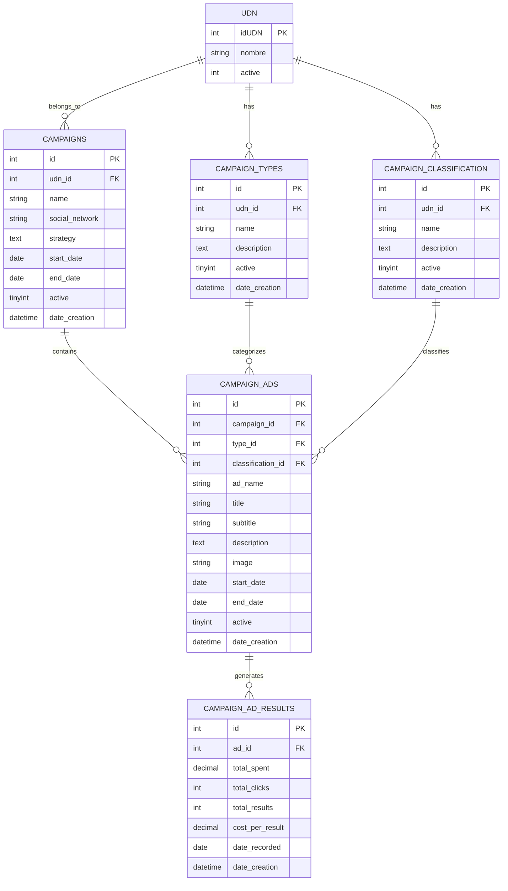

# Design Document

## Overview

El módulo KPI de campañas es un sistema integral de gestión y análisis de campañas de marketing digital que utiliza la arquitectura MVC del framework CoffeeSoft. El sistema permite administrar campañas publicitarias, anuncios individuales, y generar reportes analíticos con métricas clave de rendimiento. La aplicación está diseñada para ser escalable, mantenible y proporcionar una experiencia de usuario fluida con interfaces responsivas.

## Architecture

### High-Level Architecture

```
┌─────────────────────────────────────────────────────────────┐
│                    Presentation Layer                       │
├─────────────────────────────────────────────────────────────┤
│  Campaign Dashboard  │  Ads Management  │  Reports & Analytics │
│  - KPI Cards         │  - CRUD Operations│  - Campaign Summary  │
│  - Interactive Charts│  - Bulk Actions   │  - Historical Reports│
│  - Real-time Metrics │  - Filtering      │  - Export Functions  │
└─────────────────────────────────────────────────────────────┘
                                │
┌─────────────────────────────────────────────────────────────┐
│                    Business Logic Layer                     │
├─────────────────────────────────────────────────────────────┤
│           Controller (ctrl-kpi-campaign.php)               │
│  - Request Routing    │  - Data Validation │  - Response Formatting │
│  - Business Rules     │  - Error Handling  │  - Security Checks     │
└─────────────────────────────────────────────────────────────┘
                                │
┌─────────────────────────────────────────────────────────────┐
│                    Data Access Layer                        │
├─────────────────────────────────────────────────────────────┤
│             Model (mdl-kpi-campaign.php)                   │
│  - CRUD Operations    │  - Query Optimization │  - Data Aggregation │
│  - Relationship Mgmt  │  - Transaction Handling│  - Cache Management │
└─────────────────────────────────────────────────────────────┘
                                │
┌─────────────────────────────────────────────────────────────┐
│                    Database Layer                           │
├─────────────────────────────────────────────────────────────┤
│  campaign_types │ campaign_classification │ campaigns │ campaign_ads │
│  - Types mgmt   │ - Classification mgmt   │ - Campaign│ - Ad details │
│  - UDN relation │ - UDN relation          │   master  │ - Results    │
└─────────────────────────────────────────────────────────────┘
```

### Technology Stack

- **Frontend**: jQuery + CoffeeSoft Components + TailwindCSS
- **Backend**: PHP 8+ with CoffeeSoft Framework
- **Database**: MySQL 8.0+ with InnoDB engine
- **Charts**: Chart.js for interactive visualizations
- **Architecture Pattern**: MVC (Model-View-Controller)

## Components and Interfaces

### Frontend Components

#### 1. Campaign Class (Main Controller)
```javascript
class Campaign extends Templates {
    // Core Methods
    - init(): Initialize module and render layout
    - render(): Setup primary layout and tabs
    - layoutTabs(): Configure tab navigation system
    
    // Dashboard Methods
    - renderDashboard(): Load dashboard interface
    - loadDashboardData(): Fetch and display KPI metrics
    - renderDashboardContent(): Generate dashboard widgets
    - renderSocialNetworkChart(): Create pie chart for social networks
    - renderCampaignPerformanceChart(): Create bar chart for performance
    
    // Report Methods
    - renderResumen(): Campaign summary interface
    - lsResumenCampana(): Load campaign summary data
    - renderHistorial(): Historical reports interface
    - lsHistorialReports(): Load historical data
}
```

#### 2. Ads Management Class
```javascript
class Ads extends Templates {
    // CRUD Operations
    - render(): Display ads management interface
    - lsAds(): Load ads table with filtering
    - addAd(): Create new advertisement
    - editAd(id): Edit existing advertisement
    - deleteAd(id): Remove advertisement
    
    // Utility Methods
    - filterBarAds(): Setup filtering interface
    - validateAdData(): Client-side validation
}
```

#### 3. Administration Classes
```javascript
class CampaignTypes extends Templates {
    // Type Management
    - render(): Display types administration
    - lsCampaignTypes(): Load campaign types
    - addCampaignType(): Create new type
    - editCampaignType(id): Edit existing type
}

class CampaignClassification extends Templates {
    // Classification Management
    - lsCampaignClassification(): Load classifications
    - addClassification(): Create new classification
    - editClassification(id): Edit existing classification
}
```

### Backend Components

#### 1. Controller Layer (ctrl-kpi-campaign.php)
```php
class ctrl extends mdl {
    // Initialization
    - init(): Load initial data for dropdowns and filters
    
    // Dashboard Operations
    - getDashboardData(): Aggregate KPI metrics and chart data
    - getKPIMetrics(): Calculate campaign performance indicators
    - getChartData(): Prepare data for visualization components
    
    // CRUD Operations
    - lsAds(): List advertisements with filtering
    - addAd(): Create new advertisement
    - editAd(): Update advertisement data
    - deleteAd(): Remove advertisement
    - getAd(): Retrieve single advertisement
    
    // Report Operations
    - lsResumenCampana(): Generate campaign summary report
    - lsReporteCPC(): Generate CPC historical report
    - lsReporteCAC(): Generate CAC historical report
    
    // Administration
    - lsCampaignTypes(): List campaign types
    - addCampaignType(): Create campaign type
    - editCampaignType(): Update campaign type
}
```

#### 2. Model Layer (mdl-kpi-campaign.php)
```php
class mdl extends CRUD {
    // Campaign Operations
    - listCampaigns($filters): Query campaigns with filters
    - getCampaignById($id): Retrieve single campaign
    - createCampaign($data): Insert new campaign
    - updateCampaign($data): Update campaign data
    
    // Ad Operations
    - listAds($filters): Query ads with complex joins
    - getAdById($id): Retrieve ad with related data
    - createAd($data): Insert new advertisement
    - updateAd($data): Update advertisement
    - deleteAd($id): Remove advertisement
    
    // Analytics Operations
    - getDashboardMetrics($filters): Calculate KPI metrics
    - getCampaignSummary($filters): Generate summary data
    - getHistoricalData($filters): Retrieve historical reports
    
    // Administration Operations
    - listCampaignTypes($filters): Query campaign types
    - listClassifications($filters): Query classifications
    - getUDNList(): Retrieve UDN reference data
}
```

## Data Models

### Database Schema

#### Core Tables

1. **campaign_types**
   - Primary Key: `id` (INT, AUTO_INCREMENT)
   - Foreign Key: `udn_id` → `rfwsmqex_gvsl_finanzas.udn.idUDN`
   - Fields: `name`, `description`, `active`, `date_creation`
   - Indexes: `idx_udn`, `idx_active`

2. **campaign_classification**
   - Primary Key: `id` (INT, AUTO_INCREMENT)
   - Foreign Key: `udn_id` → `rfwsmqex_gvsl_finanzas.udn.idUDN`
   - Fields: `name`, `description`, `active`, `date_creation`
   - Indexes: `idx_udn`, `idx_active`

3. **campaigns**
   - Primary Key: `id` (INT, AUTO_INCREMENT)
   - Foreign Key: `udn_id` → `rfwsmqex_gvsl_finanzas.udn.idUDN`
   - Fields: `name`, `social_network`, `strategy`, `start_date`, `end_date`, `active`, `date_creation`
   - Indexes: `idx_udn`, `idx_active`, `idx_dates`

4. **campaign_ads**
   - Primary Key: `id` (INT, AUTO_INCREMENT)
   - Foreign Keys: 
     - `campaign_id` → `campaigns.id`
     - `type_id` → `campaign_types.id`
     - `classification_id` → `campaign_classification.id`
   - Fields: `ad_name`, `title`, `subtitle`, `description`, `image`, `start_date`, `end_date`, `active`, `date_creation`
   - Indexes: `idx_campaign`, `idx_type`, `idx_classification`, `idx_active`

5. **campaign_ad_results**
   - Primary Key: `id` (INT, AUTO_INCREMENT)
   - Foreign Key: `ad_id` → `campaign_ads.id`
   - Fields: `total_spent`, `total_clicks`, `total_results`, `cost_per_result`, `date_recorded`, `date_creation`
   - Indexes: `idx_ad`, `idx_date`

### Data Relationships



## Error Handling

### Frontend Error Handling

1. **AJAX Request Failures**
   ```javascript
   try {
       const response = await useFetch({...});
       if (response.status !== 200) {
           throw new Error(response.message);
       }
   } catch (error) {
       console.error('Error:', error);
       alert({
           icon: "error",
           title: "Error",
           text: "No se pudo completar la operación"
       });
   }
   ```

2. **Chart Rendering Errors**
   ```javascript
   if (window.chartInstance) {
       window.chartInstance.destroy();
   }
   
   try {
       window.chartInstance = new Chart(ctx, config);
   } catch (error) {
       $("#chart-container").html('<div class="alert alert-warning">Error al cargar gráfico</div>');
   }
   ```

3. **Data Validation Errors**
   ```javascript
   validateAdData() {
       const errors = [];
       if (!$("#ad_name").val()) errors.push("Nombre del anuncio es requerido");
       if (!$("#campaign_id").val()) errors.push("Debe seleccionar una campaña");
       
       if (errors.length > 0) {
           alert({
               icon: "warning",
               title: "Datos incompletos",
               text: errors.join("\n")
           });
           return false;
       }
       return true;
   }
   ```

### Backend Error Handling

1. **Database Connection Errors**
   ```php
   try {
       $result = $this->_Select([...]);
   } catch (Exception $e) {
       error_log("Database error: " . $e->getMessage());
       return [
           'status' => 500,
           'message' => 'Error interno del servidor',
           'data' => null
       ];
   }
   ```

2. **Data Validation Errors**
   ```php
   function addAd() {
       $validation = $this->validateAdData($_POST);
       if (!$validation['valid']) {
           return [
               'status' => 400,
               'message' => $validation['message'],
               'errors' => $validation['errors']
           ];
       }
       // Continue with creation...
   }
   ```

3. **Foreign Key Constraint Errors**
   ```php
   function deleteAd() {
       try {
           $hasResults = $this->checkAdResults([$_POST['id']]);
           if ($hasResults) {
               return [
                   'status' => 409,
                   'message' => 'No se puede eliminar: el anuncio tiene resultados asociados'
               ];
           }
           // Continue with deletion...
       } catch (Exception $e) {
           return [
               'status' => 500,
               'message' => 'Error al eliminar el anuncio'
           ];
       }
   }
   ```

## Testing Strategy

### Unit Testing

1. **Model Layer Testing**
   - Test CRUD operations for each entity
   - Validate data aggregation functions
   - Test foreign key constraint handling
   - Verify calculation accuracy for KPI metrics

2. **Controller Layer Testing**
   - Test request routing and parameter validation
   - Verify response format consistency
   - Test error handling scenarios
   - Validate business logic implementation

### Integration Testing

1. **Database Integration**
   - Test complex queries with joins
   - Verify transaction handling
   - Test data consistency across operations
   - Validate referential integrity

2. **Frontend-Backend Integration**
   - Test AJAX request/response cycles
   - Verify data format compatibility
   - Test error propagation from backend to frontend
   - Validate user workflow completeness

### Performance Testing

1. **Database Performance**
   - Query optimization for large datasets
   - Index effectiveness analysis
   - Connection pooling efficiency
   - Cache hit ratio monitoring

2. **Frontend Performance**
   - Chart rendering performance with large datasets
   - Table pagination and filtering speed
   - Memory usage optimization
   - Mobile device compatibility

### User Acceptance Testing

1. **Dashboard Functionality**
   - KPI accuracy verification
   - Chart interactivity testing
   - Filter functionality validation
   - Real-time data updates

2. **CRUD Operations**
   - Form validation completeness
   - Data persistence verification
   - User feedback appropriateness
   - Workflow intuitiveness

3. **Report Generation**
   - Data accuracy in reports
   - Export functionality
   - Performance with large datasets
   - Cross-browser compatibility