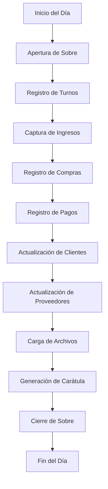

# 📊 Sistema de Contabilidad - CoffeeSoft ERP

## 📋 Índice
1. [Descripción General](#descripción-general)
2. [Arquitectura del Sistema](#arquitectura-del-sistema)
3. [Módulos del Sistema](#módulos-del-sistema)
4. [Flujo de Trabajo](#flujo-de-trabajo)
5. [Estructura de Archivos](#estructura-de-archivos)

---

## 📖 Descripción General

El **Sistema de Contabilidad** es un módulo integral del ERP CoffeeSoft diseñado para gestionar todas las operaciones financieras diarias de una empresa. Permite el control de ingresos, egresos, compras, pagos, clientes, proveedores y la generación de reportes contables.

### Características Principales
- ✅ Gestión de sobres diarios por UDN (Unidad de Negocio)
- ✅ Control de turnos y aperturas de caja
- ✅ Registro de ingresos y ventas
- ✅ Administración de compras y gastos
- ✅ Control de pagos y salidas
- ✅ Gestión de clientes y proveedores
- ✅ Manejo de archivos y comprobantes
- ✅ Generación de carátulas contables
- ✅ Consultas y reportes financieros

---

## 🏗️ Arquitectura del Sistema

El sistema sigue el patrón **MVC (Modelo-Vista-Controlador)** con la arquitectura CoffeeSoft:

```
contabilidad/
├── index.php              # Punto de entrada (redirige a sobres.php)
├── sobres.php             # Vista principal - Gestión de sobres
├── caratula.php           # Vista - Carátula contable
├── consultas.php          # Vista - Consultas y reportes
├── administracion.php     # Vista - Administración del sistema
│
├── ctrl/                  # Controladores (Lógica de negocio)
│   ├── _Contabilidad.php  # Controlador principal
│   ├── _Sobres.php        # Control de sobres
│   ├── _Apertura.php      # Control de aperturas
│   ├── _Ingresos.php      # Control de ingresos
│   ├── _Compras.php       # Control de compras
│   ├── _Pagos.php         # Control de pagos
│   ├── _Clientes.php      # Control de clientes
│   ├── _Proveedores.php   # Control de proveedores
│   ├── _Archivos.php      # Control de archivos
│   ├── _Facturas.php      # Control de facturas
│   ├── _Caratula.php      # Control de carátulas
│   ├── _Turnos.php        # Control de turnos
│   └── _Conceptos.php     # Control de conceptos
│
├── mdl/                   # Modelos (Acceso a datos)
│   ├── mdl-contabilidad.php
│   ├── mdl-sobres.php
│   ├── mdl-apertura.php
│   ├── mdl-ingresos.php
│   ├── mdl-compras.php
│   ├── mdl-pagos.php
│   ├── mdl-clientes.php
│   ├── mdl-proveedores.php
│   ├── mdl-archivos.php
│   ├── mdl-facturas.php
│   ├── mdl-caratula.php
│   └── mdl-turno.php
│
└── src/                   # Recursos frontend
    └── js/                # Scripts JavaScript
        ├── _Contabilidad.js    # Clase base
        ├── _Sobres.js
        ├── _Apertura.js
        ├── _Ingresos.js
        ├── _Compras.js
        ├── _Pagos.js
        ├── _Clientes.js
        ├── _Proveedores.js
        ├── _Archivos.js
        ├── _Facturas.js
        ├── _Caratula.js
        ├── _Turnos.js
        ├── _Conceptos.js
        ├── sobres.js           # App principal
        ├── administracion.js   # App administración
        ├── caratula.js         # App carátula
        └── consultas.js        # App consultas
```

---

## 📦 Módulos del Sistema

### 1. 📂 **Sobres** (Módulo Principal)
**Archivo:** `sobres.php`

El módulo de sobres es el corazón del sistema contable. Permite gestionar todas las operaciones financieras diarias organizadas por UDN y fecha.

#### Funcionalidades:
- **Saldos de Caja:**
  - Visualización de saldo inicial
  - Cálculo automático de egresos
  - Saldo final en tiempo real

- **Pestañas de Gestión:**
  1. **Turnos** (solo para UDN específicas)
  2. **Ingresos**
  3. **Compras**
  4. **Pagos y Salidas**
  5. **Clientes**
  6. **Proveedores**
  7. **Archivos**

#### Componentes Clave:
```javascript
// Inicialización
const conta = new Contabilidad();
const soft = new Soft(ctrlsobres);
const turn = new Turnos(ctrlsobres);
const ing = new Ingresos(ctrlsobres);
const pagos = new Pagos(ctrlsobres);
const compras = new Compras(ctrlsobres);
```

#### Filtros:
- **UDN:** Selección de unidad de negocio
- **Fecha:** Selector de fechas permitidas

---

### 2. 🔄 **Turnos**
**Clase:** `Turnos` | **Controlador:** `_Turnos.php` | **Modelo:** `mdl-turno.php`

Gestiona los turnos de trabajo y el control de caja por turno.

#### Funcionalidades:
- Registro de apertura de turno
- Control de ventas por turno
- Cierre de turno
- Conciliación de efectivo

#### Métodos Principales:
```javascript
turn.Container   = "#Container";
turn.tbContainer = "#tbContainer";
turn.Dates       = "#cbDate";
turn.UDN         = "#cbUDN";
turn.render();
```

---

### 3. 💰 **Ingresos**
**Clase:** `Ingresos` | **Controlador:** `_Ingresos.php` | **Modelo:** `mdl-ingresos.php`

Administra todos los ingresos de la empresa.

#### Funcionalidades:
- Registro de ventas
- Carga de archivos de ventas
- Visualización de caja
- Integración con SoftRestaurant
- Bitácora de CCTV

#### Métodos Principales:
```javascript
ing.incomes();           // Renderiza módulo de ingresos
ing.uploadFile();        // Carga archivo de ventas
ing.showBox();           // Muestra caja del día
ing.showSales();         // Muestra ventas detalladas
ing.saveIncome();        // Guarda ingreso manual
ing.uploadBitacoraCCTV(); // Carga bitácora de cámaras
```

#### Tipos de Ingresos:
- Ventas del día
- Ingresos extraordinarios
- Recuperación de cartera
- Otros ingresos

---

### 4. 🛒 **Compras**
**Clase:** `Compras` | **Controlador:** `_Compras.php` | **Modelo:** `mdl-compras.php`

Gestiona las compras y gastos de la empresa.

#### Funcionalidades:
- Registro de compras
- Carga de facturas
- Clasificación por tipo de gasto
- Vinculación con proveedores
- Gestión de IVA

#### Métodos Principales:
```javascript
compras.buys();          // Lista compras
compras.newBuy();        // Nueva compra
compras.newBuyFile();    // Compra con archivo
compras.editBuy(folio);  // Editar compra
compras.deleteBuy(folio); // Eliminar compra
compras.fileBill(id);    // Ver factura
```

#### Datos de Compra:
- Proveedor
- Clase de insumo
- Insumo específico
- Salida de compra
- Tipo de pago
- Subtotal e IVA
- Número de factura
- Comprobante

---

### 5. 💳 **Pagos y Salidas**
**Clase:** `Pagos` | **Controlador:** `_Pagos.php` | **Modelo:** `mdl-pagos.php`

Controla todos los pagos y salidas de efectivo.

#### Funcionalidades:
- Registro de pagos a proveedores
- Anticipos a empleados
- Gastos diversos
- Salidas de caja
- Observaciones y justificaciones

#### Métodos Principales:
```javascript
pagos.pays();            // Lista pagos
pagos.newPay();          // Nuevo pago
pagos.editPay(folio);    // Editar pago
pagos.deletePay(folio);  // Eliminar pago
pagos.viewObsPay(folio); // Ver observaciones
```

---

### 6. 👥 **Clientes**
**Clase:** `Clientes` | **Controlador:** `_Clientes.php` | **Modelo:** `mdl-clientes.php`

Administra la cartera de clientes y sus movimientos.

#### Funcionalidades:
- Registro de clientes
- Control de créditos
- Pagos de clientes
- Historial de movimientos
- Estado de cuenta

#### Métodos Principales:
```javascript
clientes.customers();              // Lista clientes
clientes.tbDayCustomer(customer);  // Movimientos del día
clientes.payDebt();                // Registrar pago
clientes.editMovCustomer(folio);   // Editar movimiento
clientes.deleteMovCustomer(folio); // Eliminar movimiento
```

---

### 7. 🏢 **Proveedores**
**Clase:** `Proveedores` | **Controlador:** `_Proveedores.php` | **Modelo:** `mdl-proveedores.php`

Gestiona proveedores y cuentas por pagar.

#### Funcionalidades:
- Catálogo de proveedores
- Cuentas por pagar
- Pagos a proveedores
- Historial de compras
- Estado de cuenta

#### Métodos Principales:
```javascript
proveedores.suppliers();              // Lista proveedores
proveedores.tbSuppliersDay(supplier); // Movimientos del día
proveedores.editMovSuppliers(folio);  // Editar movimiento
proveedores.deleteMovSuppliers(folio); // Eliminar movimiento
```

---

### 8. 📎 **Archivos**
**Clase:** `Archivos` | **Controlador:** `_Archivos.php` | **Modelo:** `mdl-archivos.php`

Administra todos los archivos y comprobantes del sistema.

#### Funcionalidades:
- Almacenamiento de comprobantes
- Facturas digitales
- Documentos de respaldo
- Organización por fecha y tipo
- Visualización y descarga

#### Métodos Principales:
```javascript
archivos.files();         // Lista archivos
archivos.deleteFile(opc); // Eliminar archivo
```

---

### 9. 📄 **Carátula**
**Archivo:** `caratula.php` | **Clase:** `Caratula`

Genera la carátula contable del día con todos los movimientos.

#### Funcionalidades:
- Resumen de ingresos
- Resumen de egresos
- Saldos finales
- Formato imprimible
- Exportación a Excel

#### Componentes:
```javascript
// Filtros
- Selector de UDN
- Selector de fecha
- Botón de impresión
```

---

### 10. 🔍 **Consultas**
**Archivo:** `consultas.php` | **Clase:** `Consultas`

Módulo de reportes y consultas avanzadas del sistema contable.

#### Funcionalidades Principales:
- **Selector de Rango de Fechas:** Con presets predefinidos (últimos 7 días, mes actual, año actual, etc.)
- **Consultas de Ingresos:** Desglose completo de ventas, descuentos, impuestos y caja
- **Reportes de Compras:** Por tipo, clasificación y forma de pago
- **Análisis de Almacén y Costos:** Entradas, salidas y saldos
- **Estado de Cuenta de Clientes:** Consumos, pagos y saldos por período
- **Estado de Cuenta de Proveedores:** Compras, pagos y cuentas por pagar
- **Consulta de Archivos:** Comprobantes y documentos del período
- **Exportación a Excel:** Con formato y columnas fijas

#### Pestañas del Módulo:

**1. Ingresos:**
- Ventas sin impuestos por concepto
- Descuentos aplicados
- Impuestos desglosados (IVA, IEPS, etc.)
- Subtotal y total de ventas
- Efectivo, monedas y bancos
- Movimientos de clientes (pagos y consumos)
- Diferencia de caja
- Totales por fecha y gran total

**2. Compras:**
- Filtro por tipo: Fondo, Corporativo, Crédito, Almacén, Todas
- Filtro por forma de pago (cuando aplica)
- Vista totales o detallada
- Desglose por clase de insumo
- Subtotal e impuestos por concepto
- Detalle de compras al hacer clic en fecha
- Exportación a Excel

**3. Almacén y Costos:**
- Filtro: Almacén o Costos
- Saldo inicial de almacén
- Entradas (compras)
- Salidas (pagos)
- Saldo final
- Desglose por tipo de almacén
- Análisis de costos directos e indirectos

**4. Clientes:**
- Saldo inicial por cliente
- Consumos del período
- Pagos recibidos
- Saldo final
- Movimientos por fecha
- Expandir/contraer detalles

**5. Proveedores:**
- Saldo inicial por proveedor
- Compras del período
- Pagos realizados
- Saldo final (cuentas por pagar)
- Movimientos por fecha
- Expandir/contraer detalles

**6. Archivos:**
- Filtros por tipo de archivo
- Lista de archivos cargados
- Fecha de carga y usuario
- Visualización y descarga

#### Rangos de Fecha Predefinidos:
- **Últimos 7 días:** Consulta de la última semana
- **Mes actual:** Del inicio del mes hasta ayer
- **Mes anterior:** Todo el mes anterior completo
- **Año actual:** Del inicio del año hasta ayer
- **Año anterior:** Todo el año anterior completo
- **Personalizado:** Seleccionar fechas manualmente

#### Características Visuales:
- Tablas con scroll horizontal y vertical
- Columnas fijas (primeras 2 columnas)
- Filas expandibles/contraíbles con iconos
- Colores diferenciados por sección
- Formato de moneda con separadores
- Responsive design

#### Exportación a Excel:
- Columnas fijas para mejor lectura
- Formato de moneda automático
- Conversión de guiones (-) a ceros
- Nombre de archivo con UDN y fecha
- Función: `tableFixedExport()`

#### Métodos Principales:
```javascript
// Inicialización
init()                      // Carga datos iniciales
createTabs()                // Crea pestañas del módulo
historyTabs()               // Restaura última pestaña visitada

// Pestañas
tabIngresos()               // Consulta de ingresos
tabCompras()                // Consulta de compras
tabPagos()                  // Consulta de almacén y costos
tabClientes()               // Estado de cuenta clientes
tabProveedor()              // Estado de cuenta proveedores
tabArchivos()               // Consulta de archivos

// Utilidades
changeUDN()                 // Cambio de UDN
saldos()                    // Muestra saldos de fondo
viewDetails()               // Ver detalles de compras
```

---

### 11. ⚙️ **Administración**
**Archivo:** `administracion.php`

Panel de configuración y administración del sistema.

#### Pestañas:

#### 11.1 **Aperturas**
**Clase:** `Apertura` | **Controlador:** `_Apertura.php`

Gestiona las aperturas y cierres de sobres.

**Funcionalidades:**
- Apertura de sobres por UDN
- Cierre de sobres
- Control de fechas permitidas
- Validación de operaciones fuera de horario

**Métodos:**
```javascript
apertura.aperturas();    // Lista aperturas
apertura.openTabs();     // Abrir sobres
apertura.closedUDN(mod); // Cerrar UDN
apertura.outhours();     // Operaciones fuera de horario
```

#### 11.2 **Conceptos**
**Clase:** `Conceptos` | **Controlador:** `_Conceptos.php`

Administra los conceptos contables del sistema.

**Funcionalidades:**
- Catálogo de conceptos de ingreso
- Catálogo de conceptos de egreso
- Clasificación de gastos
- Tipos de pago

**Métodos:**
```javascript
concepto.conceptos();    // Lista conceptos
concepto.addConcept();   // Agregar concepto
```

---

## 🔄 Flujo de Trabajo

### Flujo Diario Típico:



### Proceso de Apertura:
1. Seleccionar UDN
2. Verificar fecha permitida
3. Registrar saldo inicial
4. Abrir sobre del día

### Proceso de Registro de Movimientos:
1. Seleccionar tipo de movimiento (Ingreso/Egreso)
2. Capturar datos del movimiento
3. Adjuntar comprobante (opcional)
4. Validar información
5. Guardar movimiento
6. Actualizar saldos automáticamente

### Proceso de Cierre:
1. Verificar todos los movimientos del día
2. Conciliar saldos
3. Generar carátula
4. Cerrar sobre
5. Bloquear ediciones

---

## 🛠️ Estructura de Archivos

### Controladores (ctrl/)

Todos los controladores heredan de la clase base `Contabilidad`:

```php
class Contabilidad {
    private $sobres;
    private $apertura;
    private $conceptos;
    private $ingresos;
    // ... más módulos
    
    public function __construct() {
        $this->sobres = new Sobres($this);
        $this->apertura = new Apertura($this);
        // ... inicialización de módulos
    }
}
```

### Modelos (mdl/)

Todos los modelos heredan de `CRUD`:

```php
class MContabilidad extends CRUD {
    protected $bd_fzas = 'rfwsmqex_gvsl_finanzas2.';
    protected $bd_ch = 'rfwsmqex_gvsl_rrhh.';
    
    public function getFzas() {
        return $this->bd_fzas;
    }
}
```

### Frontend (src/js/)

Clase base `Contabilidad` con métodos compartidos:

```javascript
class Contabilidad {
    constructor(ctrl) {
        this._ctrl = ctrl;
    }
    
    // Métodos compartidos
    async fnDateUDN(options, before = "") { }
    async fechasPermitidas(filtro) { }
    createModal(options) { }
    dropdown(options) { }
    format_number(number, prefix = "$", decimals = 2) { }
    // ... más métodos
}
```

---

## 📊 Componentes Visuales

### Saldos de Caja
```html
<div id="saldoCaja">
    <div>Saldo inicial: $X,XXX.XX</div>
    <div>Egresos: $X,XXX.XX</div>
    <div>Saldo final: $X,XXX.XX</div>
</div>
```

### Filtros
```html
<select id="cbUDN"><!-- UDN --></select>
<input type="date" id="cbDate"><!-- Fecha --></input>
```

### Tabs de Navegación
Sistema de pestañas dinámico con `simple_json_nav`:
```javascript
$("#bodySobres").simple_json_nav([
    { tab: "Ingresos", fn: "tabIngresos()" },
    { tab: "Compras", fn: "tabCompras()" },
    // ... más tabs
]);
```

---

## 🔐 Seguridad

- Validación de sesión en cada página
- Control de permisos por UDN
- Validación de fechas permitidas
- Registro de auditoría de movimientos
- Bloqueo de ediciones en sobres cerrados

---

## 📱 Responsive Design

El sistema está optimizado para:
- 💻 Desktop
- 📱 Tablet
- 📱 Mobile

Con componentes adaptables usando Bootstrap y TailwindCSS.

---

## 🚀 Tecnologías Utilizadas

- **Backend:** PHP 7+
- **Frontend:** JavaScript (ES6+), jQuery
- **Framework:** CoffeeSoft
- **Estilos:** Bootstrap 5, TailwindCSS
- **Base de Datos:** MySQL
- **Plugins:** DataTables, Bootbox, SweetAlert2

---

## 📝 Notas Importantes

1. **Fechas Permitidas:** Solo se pueden realizar operaciones en fechas habilitadas por el sistema
2. **Cierre de Sobres:** Una vez cerrado un sobre, no se pueden realizar modificaciones
3. **Saldos Automáticos:** Los saldos se calculan automáticamente con cada movimiento
4. **Comprobantes:** Es recomendable adjuntar comprobantes a todos los movimientos
5. **Conciliación:** Se debe conciliar diariamente con los sistemas externos (SoftRestaurant, etc.)

---

## 🆘 Soporte

Para soporte técnico o dudas sobre el sistema, contactar al equipo de desarrollo de CoffeeSoft.

---

**Versión:** 2.0  
**Última actualización:** Mayo 2025  
**Desarrollado por:** CoffeeSoft Development Team ☕
