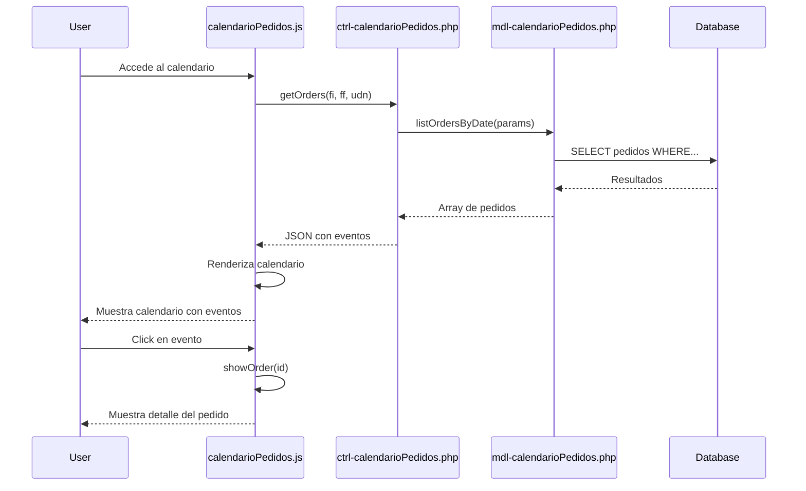

# Design Document

## Overview

El módulo de **Calendario de Pedidos** se integrará al sistema existente de gestión de pedidos, proporcionando una vista de calendario interactiva que visualiza los pedidos organizados por fechas. El diseño se basa en la arquitectura MVC de CoffeeSoft, reutilizando componentes existentes y siguiendo los patrones establecidos en el sistema.

El módulo utilizará la librería **FullCalendar** para la renderización del calendario, integrándose con el sistema de colores corporativos y la funcionalidad existente de visualización de pedidos.

## Architecture

### Componentes Principales

```
calendario-pedidos/
├── index.php                          # Vista principal del calendario
├── ctrl/
│   └── ctrl-calendarioPedidos.php    # Controlador para consultas de pedidos
├── mdl/
│   └── mdl-calendarioPedidos.php     # Modelo para acceso a datos
└── js/
    └── calendarioPedidos.js          # Lógica del calendario y eventos
```

### Flujo de Datos



## Components and Interfaces

### 1. Frontend (calendarioPedidos.js)

#### Clase Principal: CalendarApp

```javascript
class CalendarApp extends Templates {
    constructor(link, divModule) {
        super(link, divModule);
        this.PROJECT_NAME = "CalendarioPedidos";
        this.calendar = null;
    }

    // Métodos principales
    render()              // Inicializa el layout y el calendario
    layout()              // Estructura HTML del módulo
    filterBar()           // Barra de filtros (fechas, sucursal)
    initCalendar()        // Inicializa FullCalendar
    loadEvents()          // Carga eventos desde el backend
    handleEventClick()    // Maneja click en eventos
    getEventColor()       // Retorna color según estado
}
```

#### Configuración de FullCalendar

```javascript
{
    initialView: 'dayGridMonth',
    locale: 'es',
    headerToolbar: {
        left: 'prev,next today',
        center: 'title',
        right: 'dayGridMonth,timeGridWeek,timeGridDay'
    },
    events: (info, successCallback) => {
        // Carga dinámica de eventos
    },
    eventClick: (info) => {
        // Ejecuta showOrder(id)
    },
    eventContent: (arg) => {
        // Renderizado personalizado de eventos
    }
}
```

### 2. Controlador (ctrl-calendarioPedidos.php)

#### Métodos del Controlador

```php
class ctrl extends mdl {
    
    function init() {
        // Retorna listas para filtros (sucursales, estados)
        return [
            'udn' => $this->lsUDN(),
            'status' => $this->lsStatus()
        ];
    }

    function getOrders() {
        // Obtiene pedidos para el calendario
        // Parámetros: fi, ff, udn (opcional)
        // Retorna: Array de eventos en formato FullCalendar
    }
}
```

#### Formato de Respuesta

```json
{
    "events": [
        {
            "id": "123",
            "title": "Folio #123 - Juan Pérez",
            "start": "2025-01-15T14:00:00",
            "end": "2025-01-15T15:00:00",
            "backgroundColor": "#3B82F6",
            "borderColor": "#3B82F6",
            "extendedProps": {
                "folio": "123",
                "cliente": "Juan Pérez",
                "telefono": "9999999999",
                "estado": "1",
                "total": "1500.00"
            }
        }
    ]
}
```

### 3. Modelo (mdl-calendarioPedidos.php)

#### Métodos del Modelo

```php
class mdl extends CRUD {
    
    function listOrdersByDate($array) {
        // Consulta pedidos por rango de fechas
        // Incluye: folio, cliente, fecha_entrega, hora, estado, total
        // Filtros: fi, ff, udn (opcional)
    }

    function lsUDN() {
        // Lista de sucursales para filtro
    }

    function lsStatus() {
        // Lista de estados para referencia
    }
}
```

## Data Models

### Estructura de Datos de Pedidos

```sql
SELECT 
    p.id,
    p.folio,
    p.name AS cliente,
    p.phone AS telefono,
    p.date_order AS fecha_entrega,
    p.time_order AS hora_entrega,
    p.status AS estado_id,
    e.valor AS estado_nombre,
    p.total_pay AS total,
    p.subsidiaries_id AS udn_id
FROM pedidos_orders p
LEFT JOIN pedidos_status e ON p.status = e.id
WHERE p.date_order BETWEEN ? AND ?
    AND (? IS NULL OR p.subsidiaries_id = ?)
    AND p.status != 4  -- Excluir cancelados (opcional)
ORDER BY p.date_order ASC, p.time_order ASC
```

### Mapeo de Estados a Colores

| Estado ID | Nombre | Color | Clase Tailwind |
|-----------|--------|-------|----------------|
| 1 | Cotización | Azul | bg-blue-500 |
| 2 | Pagado | Verde | bg-green-500 |
| 3 | Pendiente | Amarillo | bg-yellow-400 |
| 4 | Cancelado | Rojo | bg-red-500 |
| 5 | En proceso | Morado | bg-purple-500 |

## Error Handling

### Manejo de Errores en Frontend

```javascript
try {
    const response = await useFetch({
        url: this._link,
        data: { opc: 'getOrders', fi, ff, udn }
    });
    
    if (response.status === 200) {
        this.calendar.addEventSource(response.events);
    } else {
        alert({
            icon: 'error',
            text: 'Error al cargar los pedidos del calendario'
        });
    }
} catch (error) {
    console.error('Error en loadEvents:', error);
    alert({
        icon: 'error',
        text: 'Error de conexión con el servidor'
    });
}
```

### Validaciones en Backend

```php
// Validar fechas
if (empty($_POST['fi']) || empty($_POST['ff'])) {
    return [
        'status' => 400,
        'message' => 'Debe proporcionar un rango de fechas válido',
        'events' => []
    ];
}

// Validar formato de fechas
if (!strtotime($_POST['fi']) || !strtotime($_POST['ff'])) {
    return [
        'status' => 400,
        'message' => 'Formato de fecha inválido',
        'events' => []
    ];
}

// Validar que fi <= ff
if (strtotime($_POST['fi']) > strtotime($_POST['ff'])) {
    return [
        'status' => 400,
        'message' => 'La fecha inicial debe ser menor o igual a la fecha final',
        'events' => []
    ];
}
```

## Testing Strategy

### Pruebas Funcionales

1. **Carga de Calendario**
   - Verificar que el calendario se renderiza correctamente
   - Validar que muestra el mes actual por defecto
   - Confirmar que los controles de navegación funcionan

2. **Visualización de Eventos**
   - Verificar que los pedidos se muestran en las fechas correctas
   - Validar que los colores corresponden al estado
   - Confirmar que la información básica es visible

3. **Interacción con Eventos**
   - Verificar que el click en un evento ejecuta showOrder(id)
   - Validar que se muestra el detalle correcto del pedido
   - Confirmar que el calendario mantiene su estado después de cerrar el detalle

4. **Filtros**
   - Verificar que el filtro de fechas actualiza los eventos
   - Validar que el filtro de sucursal funciona correctamente
   - Confirmar que la combinación de filtros funciona

5. **Responsividad**
   - Verificar la vista en móvil (< 768px)
   - Validar la vista en tablet (768px - 1024px)
   - Confirmar la vista en escritorio (> 1024px)

### Casos de Prueba

```javascript
// Test 1: Calendario se inicializa correctamente
describe('CalendarApp Initialization', () => {
    it('should render calendar on page load', () => {
        const app = new CalendarApp(api, 'root');
        app.render();
        expect($('#calendar').length).toBe(1);
    });
});

// Test 2: Eventos se cargan correctamente
describe('Event Loading', () => {
    it('should load events for current month', async () => {
        const events = await app.loadEvents();
        expect(events.length).toBeGreaterThan(0);
    });
});

// Test 3: Click en evento ejecuta showOrder
describe('Event Click', () => {
    it('should call showOrder with correct ID', () => {
        spyOn(app, 'showOrder');
        app.handleEventClick({ event: { id: '123' } });
        expect(app.showOrder).toHaveBeenCalledWith('123');
    });
});
```

### Pruebas de Integración

1. **Integración con Sistema de Pedidos**
   - Verificar que showOrder() del módulo de pedidos funciona correctamente
   - Validar que los datos mostrados son consistentes con el listado de pedidos

2. **Integración con Base de Datos**
   - Verificar que las consultas retornan los datos correctos
   - Validar que los filtros se aplican correctamente en SQL

## UI/UX Considerations

### Layout del Calendario

```html
<div id="CalendarioPedidos" class="flex mx-2 my-2 p-2">
    <!-- Barra de filtros -->
    <div id="filterBarCalendarioPedidos" class="w-full my-3">
        <!-- Filtros: rango de fechas, sucursal -->
    </div>
    
    <!-- Contenedor del calendario -->
    <div id="containerCalendarioPedidos" class="w-full my-3 bg-[#1F2A37] rounded p-3">
        <div id="calendar"></div>
    </div>
</div>
```

### Estilos Personalizados

```css
/* Tema oscuro para FullCalendar */
.fc {
    background-color: #1F2A37;
    color: #fff;
}

.fc-button {
    background-color: #3B82F6 !important;
    border-color: #3B82F6 !important;
}

.fc-button:hover {
    background-color: #2563EB !important;
}

.fc-event {
    cursor: pointer;
    border-radius: 4px;
    padding: 2px 4px;
    font-size: 0.875rem;
}

.fc-event:hover {
    opacity: 0.8;
}

/* Responsive */
@media (max-width: 768px) {
    .fc-toolbar {
        flex-direction: column;
        gap: 10px;
    }
    
    .fc-event {
        font-size: 0.75rem;
    }
}
```

### Tooltip para Eventos

```javascript
eventDidMount: function(info) {
    $(info.el).tooltip({
        title: `
            <strong>Folio:</strong> ${info.event.extendedProps.folio}<br>
            <strong>Cliente:</strong> ${info.event.extendedProps.cliente}<br>
            <strong>Teléfono:</strong> ${info.event.extendedProps.telefono}<br>
            <strong>Total:</strong> ${formatPrice(info.event.extendedProps.total)}
        `,
        html: true,
        placement: 'top',
        container: 'body'
    });
}
```

## Performance Considerations

1. **Carga Lazy de Eventos**
   - Cargar solo los eventos del mes visible
   - Implementar paginación en el backend si hay muchos pedidos

2. **Caché de Datos**
   - Cachear eventos ya cargados para evitar consultas repetidas
   - Invalidar caché al aplicar filtros

3. **Optimización de Consultas**
   - Usar índices en las columnas date_order y subsidiaries_id
   - Limitar resultados con LIMIT si es necesario

## Integration Points

### Integración con Módulo de Pedidos Existente

```javascript
// En calendarioPedidos.js
handleEventClick(info) {
    const orderId = info.event.id;
    
    // Verificar si existe la función showOrder en el contexto global
    if (typeof app !== 'undefined' && typeof app.showOrder === 'function') {
        app.showOrder(orderId);
    } else {
        // Fallback: redirigir a la vista de detalle
        window.location.href = `pedidos.php?action=view&id=${orderId}`;
    }
}
```

### Navegación entre Módulos

```javascript
// Botón para volver al listado de pedidos
{
    opc: "button",
    id: "btnListado",
    class: "col-sm-2",
    text: "Ver Listado",
    onClick: () => {
        window.location.href = 'pedidos.php';
    }
}
```

## Security Considerations

1. **Validación de Permisos**
   - Verificar que el usuario tiene permisos para ver pedidos
   - Filtrar pedidos según la sucursal del usuario si aplica

2. **Sanitización de Datos**
   - Escapar datos antes de mostrarlos en el calendario
   - Validar parámetros de entrada en el backend

3. **Protección contra SQL Injection**
   - Usar prepared statements en todas las consultas
   - Validar tipos de datos de los parámetros

```php
// Ejemplo de consulta segura
function listOrdersByDate($array) {
    return $this->_Select([
        'table' => "{$this->bd}pedidos_orders",
        'values' => "id, folio, name, date_order, time_order, status, total_pay",
        'where' => 'date_order BETWEEN ? AND ? AND (? IS NULL OR subsidiaries_id = ?)',
        'data' => $array
    ]);
}
```
